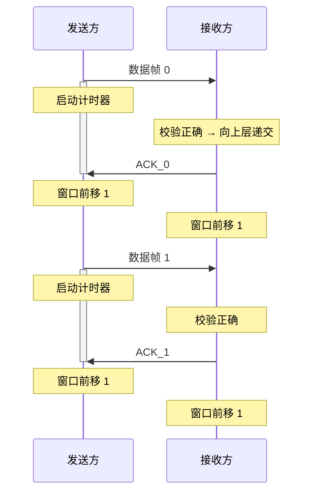
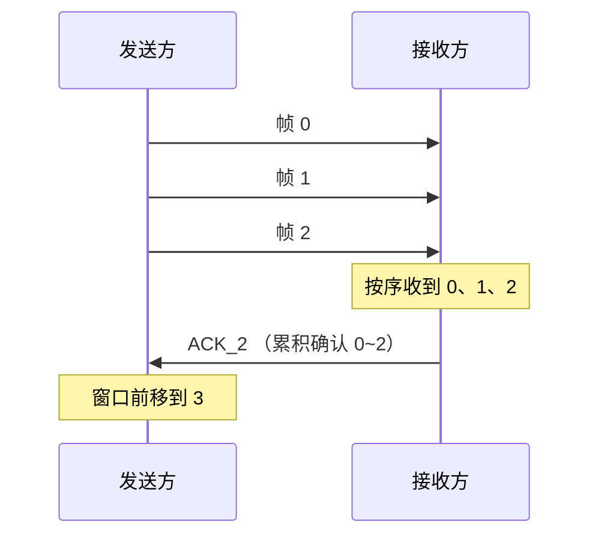

## 3.4 流量控制与可靠传输机制

![[大纲.png]]

### 概述

- **流量控制**：控制发送方的发送速率，使接收方来得及接收与处理
- **可靠传输**：保证数据无差错、不丢失、不重复、按序到达
- **实现手段**：确认机制 + 超时重传 + 滑动窗口

---

### 滑动窗口机制

#### 基本概念

- **发送窗口 $W_T$**：发送方当前允许发送的帧序号集合
- **接收窗口 $W_R$**：接收方当前允许接收的帧序号集合

#### 窗口规则

- 窗口外的帧**不允许**发送
- 收到接收窗口以外的帧，直接丢弃
- 接收方通过控制 ACK 的发送，间接控制发送方窗口的滑动 → **流量控制**

#### 帧编号约束

- 使用 $n$ 位编号时，共 $2^n$ 个可用序号
- 需满足 $W_T + W_R \leq 2^n$，以防止新旧帧因序号重叠而混淆

---

### 停止等待协议（Stop-and-Wait）

> **核心思想**：发送方每发一帧就停下来，等待接收方确认后再发下一帧。

#### 关键参数

| 参数 | 值 |
|------|:---:|
| 发送窗口 $W_T$ | $1$ |
| 接收窗口 $W_R$ | $1$ |
| 帧编号位数 | $1$ bit |
| 编号循环 | $0 \rightarrow 1 \rightarrow 0 \rightarrow 1 \rightarrow \cdots$ |
| 窗口约束 | $W_T + W_R = 2 \leq 2^1$ ✓ |

#### 正常流程

#### 异常情况处理

##### 1. 数据帧出错

- 接收方校验发现差错 → **丢弃该帧**，不发送 ACK
- 发送方**超时** → 重传该数据帧
- 重传正确 → 接收方返回 ACK，双方窗口前移

##### 2. ACK 丢失

- 接收方已正确接收并返回 ACK，但 ACK 在半路丢失
- 发送方**超时** → 重传数据帧（发送方不知是 ACK 丢了）
- 接收方收到**重复帧** → 识别帧编号 → 丢弃该帧 → **重发 ACK**

##### 3. 收到重复帧

- 接收方通过帧编号识别（连续收到两个同编号帧）
- 丢弃重复帧，再次发送对应 ACK

#### 特点

| 优点 | 缺点 |
|------|------|
| 实现简单 | 信道利用率低（大量时间花在等待确认） |
| 不存在"数据帧失序"问题 | 适用于信道质量好、距离近的场景 |

> **流量控制实现**：接收方通过控制 ACK 的发送来间接控制发送方窗口的滑动，发送方只有在收到 ACK 后才能前移窗口。数据帧绝不会失序（因为一次只发一帧，$W_T = 1$）。

---

### 后退 N 帧协议 — GBN（Go-Back-N）

> **核心思想**：发送方可连续发送多帧（流水线），接收方只按序接收。某帧出错或超时后，发送方**回退**到该帧，重传它及其后已发的所有帧。

#### 关键参数

| 参数 | 值 |
|------|:---:|
| 发送窗口 $W_T$ | $> 1$ |
| 接收窗口 $W_R$ | $1$（只按序接收一帧） |
| 帧编号位数 | $n$ bit（与窗口大小有关，$n = \lceil \log_2(\text{窗口大小}) \rceil$ 起步） |
| 窗口约束 | $W_T + W_R \leq 2^n$，即 $W_T \leq 2^n - 1$ |

#### 工作要点

- **流水线发送**：发送方不必每发一帧就停等，可连续发出窗口内所有帧
- **只按序接收**：接收方 $W_R = 1$，只接收序号正确的下一帧；**失序帧一律丢弃**
- **累积确认**：接收方连续收到多帧后，可只返回最后一帧的 ACK
  - $\text{ACK}_i$ 表示「$i$ 号及之前的所有帧」都已正确收到
  - 好处：即使个别 ACK 丢失，后续 ACK 也能补充确认

#### 正常流程

#### 异常情况处理

##### 1. 数据帧丢失

- 若 0 号数据帧丢失，后续帧（1、2、3…）因失序被接收方**全部丢弃**
- 接收方始终返回「最后一个按序正确收到帧」的 ACK
- 发送方超时后**回退到 0 号**，重传 0 号及其后所有已发帧

> 注：若是中途某帧丢失（如已正确收到 1、2、3，4 号丢失），接收方持续返回 $\text{ACK}_3$；发送方超时后回退到 4 号，从 $3+1=4$ 开始重传。

##### 2. ACK 丢失

- 若 0 号 ACK 丢失，但后续 ACK 能累积确认 → **不必重传**
- 若该 ACK 之后再无新的 ACK 补充 → 发送方超时 → **回退到 0 号**，重传 0 号及后面所有帧

#### ⚠️ 易错点：为什么必须满足 $W_T + W_R \leq 2^n$？

> **若不满足（即 $W_T$ 取到 $2^n$），接收方将无法区分「新帧」和「旧帧的重传」。**

**举例说明**（设 $n = 2$，序号 $0\sim3$ 循环，错误地取 $W_T = 4$）：

1. 发送方连发 0、1、2、3 四帧，接收方**全部正确收到**，逐一返回 ACK
2. 但**所有 ACK 都在半路丢失**
3. 接收方此时期待下一轮的 0 号（新数据）
4. 发送方因收不到 ACK，超时**重传旧的 0 号**
5. 接收方看到 0 号，**误以为是新一轮的数据帧** → 错误接收 ❌

**根因**：序号空间 $2^n$ 被发送窗口占满，新旧帧序号完全重叠，接收方失去辨别能力。

✅ 因此 GBN 中 $W_T \leq 2^n - 1$——必须留出至少一个序号作"缓冲"，让新旧帧的序号永不重叠。

#### 特点

| 优点 | 缺点 |
|------|------|
| 信道利用率比停止等待高（流水线发送） | 一帧出错可能引发大量重传（后面正确到达的帧也要重传） |
| 累积确认，对 ACK 丢失有一定容错 | 信道误码率高时性能急剧下降 |

---

### 选择重传协议 — SR（Selective Repeat）

> **核心思想**：接收方**允许失序接收**并缓存窗口内的帧，发送方只重传真正出错/丢失的那一帧，不牵连其他帧。这是对 GBN「一错全重传」的改进。

#### 关键参数

| 参数 | 值 |
|------|:---:|
| 发送窗口 $W_T$ | $> 1$ |
| 接收窗口 $W_R$ | $> 1$，且 $W_R \leq W_T$ |
| 帧编号位数 | $n$ bit |
| 窗口约束 | $W_T + W_R \leq 2^n$（典型取 $W_T = W_R = 2^{n-1}$） |
| 否认帧 | $\text{NAK}_i$：明确请求重传 $i$ 号帧 |

#### 工作要点

- **失序接收 + 缓存**：接收方可连续接收多个帧，失序的帧先存入缓冲区，等空缺补齐后再按序上交高层
- **逐帧确认**：每正确收到一帧都要返回对应的 ACK（**与 GBN 的累积确认区分**）
- **独立计时器**：发送方为**每一个已发送帧**单独设置计时器，某帧超时只重传它自己

#### 窗口如何移动？

> 这是 SR 最容易混淆的点，分发送方和接收方两边看。

- **接收方窗口**：只有当**窗口最左端（最低序号）的帧**被正确收到后，窗口才向前滑动；若左端有空缺（该帧未到），即使后面的帧已收到并缓存，窗口也**不能移动**
- **发送方窗口**：只有当**窗口最左端的帧**收到 ACK 后，窗口才向前滑动；中间帧的 ACK 先到只做标记，不推动左边界

> 💡 一句话：**两边窗口都"卡左端"——左端不落实，窗口不前移。**

#### 异常情况处理

##### 1. 数据帧出错/丢失（请求重传）

- 接收方发现某帧出错 → 返回对应的 $\text{NAK}_i$
- 发送方收到 NAK 后，**不必等超时**即可立即重传 $i$ 号帧（计时器归零）
- 其余已正确接收的帧**保留在接收缓冲区**，不受影响

##### 2. ACK 丢失

- 某帧的 ACK 丢失，但发送方窗口左端被卡住，无法前移
- 发送方对该帧**超时** → 重传该帧
- 接收方发现这是个**已收过的帧**（落在接收窗口之外）→ 判定为重复 → 丢弃 → 重新回送对应 ACK

#### ⚠️ 易错点：为什么必须满足 $W_T + W_R \leq 2^n$？

> **若不满足，接收方将无法判别「新帧」与「重复的旧帧」。**

**根因**：SR 接收窗口 $> 1$，能接收一段序号范围。若 $W_T + W_R > 2^n$，发送窗口和接收窗口在序号空间上会**重叠**——当旧帧重传时，其序号可能正好落在接收方期待的新帧序号范围内，接收方**误把重复的旧帧当成新帧接收**。

> 这正是为什么 SR 通常取 $W_T = W_R = 2^{n-1}$——恰好把序号空间二等分，新旧帧序号永不重叠。

#### 特点

| 优点 | 缺点 |
|------|------|
| 重传效率最高（只重传出错帧） | 实现复杂（接收方需缓冲区、发送方需多个计时器） |
| 信道利用率最高 | 需要更大的接收窗口和缓存开销 |

#### GBN 与 SR 对比

|            | GBN（后退 N 帧） |  SR（选择重传）   |
| ---------- | :---------: | :---------: |
| 接收窗口 $W_R$ |     $1$     |    $> 1$    |
| 失序帧        |    直接丢弃     |     缓存      |
| 确认方式       |    累积确认     | 逐帧确认（含 NAK） |
| 计时器        | 一个（最早未确认帧）  |    每帧一个     |
| 重传范围       |  出错帧及其后所有帧  |    仅出错帧     |
| 复杂度        |     较低      |     较高      |

### 信道利用率分析

> **信道利用率**：在一个发送周期内，真正用于传输有效数据的时间占比。它是考研 408 的高频计算考点。

#### 🧠 回忆录

| 协议 | 利用率公式 | 关键变量 |
|------|----------|---------|
| 停止等待 | $U = \dfrac{T_D}{T_D + \text{RTT} + T_A}$ | 固定，与窗口无关 |
| GBN / SR | $U = \min\!\left(1,\; \dfrac{W_T \cdot T_D}{T_D + \text{RTT} + T_A}\right)$ | $W_T$ 越大利用率越高，有上限 |

> 💡 **核心认知**：停等协议的致命伤不是"窗口小"，而是**发完一帧后干等 RTT**——这段时间信道完全空闲。GBN/SR 用流水线填满了这个空等期。

---

#### 术语速查

| 术语 | 全称 | 含义 |
|------|------|------|
| ARQ | Automatic Repeat reQuest | 基于确认+重传的可靠传输协议总称 |
| 停止等待 ARQ | Stop-and-Wait ARQ | $W_T = 1$ 的 ARQ |
| 连续 ARQ | Continuous ARQ | $W_T > 1$ 的 ARQ，即 GBN 和 SR 的统称 |
| 滑动窗口协议 | Sliding Window Protocol | **考研语境下特指 GBN 或 SR**（$W_T > 1$） |

---

#### 停止等待协议的利用率

**时间线分析：**

```mermaid
gantt
    title 停止等待协议 —— 一个完整周期
    dateFormat X
    axisFormat %s

    section 发送方
    发送数据帧（T_D）              :done, tx, 0, 1
    空闲等待                       :crit, idle, after tx, 5
    发送下一帧（T_D）              :done, tx2, after ack_back, 1

    section 接收方
    数据传播 t_p                    :active, prop1, after tx, 2
    发送ACK（T_A）                 :done, ack_tx, after prop1, 1
    ACK传播 t_p                     :active, prop2, after ack_tx, 2

    收到ACK                        :milestone, ack_back, after prop2, 0
```

> 一个周期 = **T_D + RTT + T_A**（RTT = $2 \times t_p$）

- $T_D = \dfrac{\text{数据帧长度 } L}{\text{发送速率 } C}$ —— 数据帧的发送时延
- $T_A = \dfrac{\text{ACK帧长度 } L_A}{C}$ —— ACK 的发送时延（通常很小，可近似为 0）
- $\text{RTT} = 2 \times \dfrac{\text{距离 } D}{\text{信号传播速率 } v}$ —— 往返传播时延

$$
U_{\text{S\&W}} = \frac{T_D}{T_D + \text{RTT} + T_A}
$$

> ⚠️ **分母为什么是 $T_D + \text{RTT} + T_A$ 而不是单纯 RTT？**
>
> 因为发送数据帧本身也占时间——发送方必须先花 $T_D$ 把帧发完，然后才开始等 ACK。ACK 回来后再花 $T_A$ 收完 ACK，才能发下一帧。一个完整周期 = 发数据 + 传播往返 + 收 ACK。

---

#### GBN 与 SR 的利用率

> 流水线发送的本质：**ACK 还没回来，后面的帧已经发出去了**。只要窗口够大，信道就不会空等。

- **窗口较小**（$W_T \cdot T_D < T_D + \text{RTT} + T_A$）：发完 $W_T$ 帧后必须停下来等 ACK

$$
U = \frac{W_T \cdot T_D}{T_D + \text{RTT} + T_A}
$$

- **窗口够大**（$W_T \cdot T_D \geq T_D + \text{RTT} + T_A$）：ACK 回来时发送方一直在发帧，信道被填满

$$
U \approx 1 \quad\text{（100%）}
$$

**使利用率达到 100% 的最小窗口：**

$$
W_T^{\,min} = \left\lceil \frac{T_D + \text{RTT} + T_A}{T_D} \right\rceil
$$

---

#### 📐 考研典型例题

> 信道速率 $C = 1\ \text{Gbps}$，数据帧长 $L = 1000\ \text{字节}$，单向传播距离 $D = 100\ \text{km}$，信号传播速率 $v = 2 \times 10^8\ \text{m/s}$，ACK 帧长忽略不计。
>
> 求：（1）停止等待协议的利用率；（2）使利用率达到 100% 的最小发送窗口。

**解：**

**Step 1 — 计算各时延**

- $T_D = \dfrac{L}{C} = \dfrac{1000 \times 8\ \text{bit}}{10^9\ \text{bps}} = 8\ \mu\text{s}$
- 单向传播时延 $t_p = \dfrac{D}{v} = \dfrac{100 \times 10^3\ \text{m}}{2 \times 10^8\ \text{m/s}} = 0.5\ \text{ms} = 500\ \mu\text{s}$
- $\text{RTT} = 2 \times t_p = 1000\ \mu\text{s}$
- $T_A \approx 0$

**Step 2 — 停等利用率**

$$
U_{\text{S\&W}} = \frac{8}{8 + 1000 + 0} = \frac{8}{1008} \approx \mathbf{0.79\%}
$$

> 😱 1 Gbps 的信道，只用了不到 1%！大量时间在空等 ACK。

**Step 3 — 100% 利用率需多大窗口**

$$
W_T^{\,min} = \left\lceil \frac{T_D + \text{RTT} + T_A}{T_D} \right\rceil
            = \left\lceil \frac{8 + 1000 + 0}{8} \right\rceil
            = \lceil 126 \rceil = \mathbf{126}
$$

即 $W_T \geq 126$ 时，信道可被填满。对于 GBN，取 $W_T = 126$ 需 $n \geq 7$ 位编号（$2^7 - 1 = 127 \geq 126$）。

---

#### 考试秒杀技巧

> **$W_T^{\,min}$ 的口算公式**：窗口要覆盖「从发完第一帧到收到第一个 ACK」这段时间内能发送的所有帧。

$$
W_T^{\,min} \approx \frac{\text{RTT}}{T_D} + 1
$$

代入上题：$\dfrac{1000}{8} + 1 = 126$，一步出答案。
