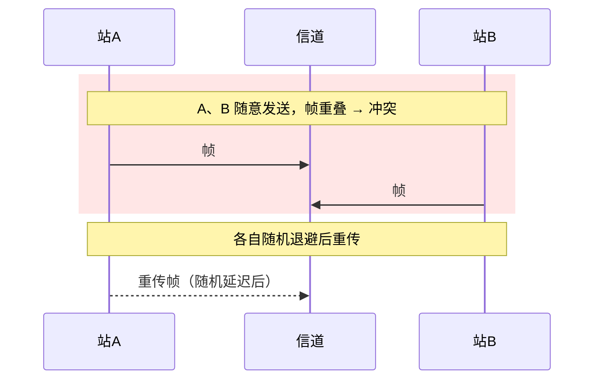
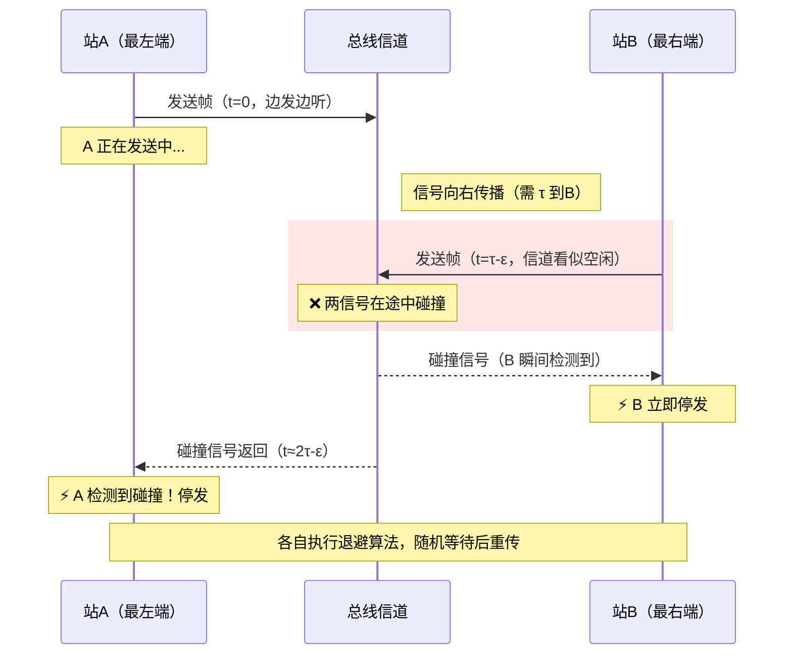
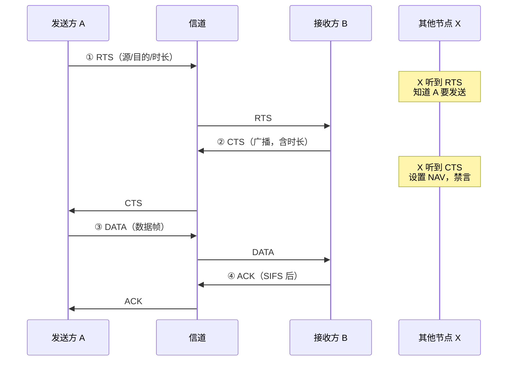

## 3.5 介质访问控制

> **介质访问控制（MAC）**：多节点共享同一信道时，协调谁先发、谁后发，避免冲突。主要分为三大类：
> - **信道划分**：提前把信道资源切好，分配给各节点，互不干扰
> - **随机访问**：各节点**争用**信道，冲突后按规则重传——不预先分配，靠协议协调
> - **轮询访问**：令牌轮流传递，持令牌者发送——无冲突，适合高负载

---

### 一、信道划分协议

#### 🧠 回忆录

| 方法 | 划分维度 | 核心机制 | 一句话 |
|------|:---:|---------|--------|
| TDM 时分复用 | 时间 | 固定时隙，轮流使用 | 人人有份，但不用也得占着 |
| STDM 统计时分 | 时间 | 动态分配，按需给 | TDM 的智能版——不用不占 |
| FDM 频分复用 | 频率 | 划分子频带，并存不冲突 | 模拟信号专享 |
| WDM 波分复用 | 波长 | 光的 FDM，多波长合路 | 光纤上的频分复用 |
| CDM 码分复用 | 码片 | 正交码片序列，规格化内积分离 | 同频同时，靠"码"区分 |

---

### 时分复用 — TDM

- 将时间划分为等长的 **TDM 帧**，每帧再等分为 $m$ 个**时隙**
- 每个时隙固定分配给一个用户——无论该用户有没有数据要发
- **优点**：实现简单，无冲突
- **缺点**：每个节点只能分到 $\frac{1}{m}$ 带宽；若某节点空闲，对应时隙**空转浪费**，信道利用率低

```
TDM帧: | 时隙1 | 时隙2 | 时隙3 | 时隙4 | 时隙1 | 时隙2 | ...
          ↑       ↑       ↑       ↑
         用户A    用户B    用户C    用户D     (固定分配，轮流使用)
```

### 统计时分复用 — STDM

- 也称**异步时分复用**，是对 TDM 的改进
- **不再固定分配**：哪个节点有数据就给它时隙，没有数据的节点跳过
- 每个时隙前需携带**地址标识**（接收方才知道这是谁的帧）
- **优点**：信道利用率高（空闲节点不占时隙）
- **缺点**：实现比 TDM 复杂，需要额外开销（地址字段）

```
STDM:     | 数据A | 数据C |  数据A  | 数据D | ...
不加空时隙，只排有数据发的节点
```

### 频分复用 — FDM

- 将总频带划分为**多个互不重叠的子频带**，同时传输多路信号
- 总频带宽度 = 各路信号带宽之和（理论上充分利用）
- **优点**：多路信号**并行传输**，互不干扰
- **缺点**：只适用于**模拟信号**（数字信号需先调制）；子频带之间需要保护间隔

```
频率
 ↑
 ├─────────────┐
 │   子频带 4   │  用户 D
 ├─────────────┤
 │   子频带 3   │  用户 C
 ├─────────────┤
 │   子频带 2   │  用户 B
 ├─────────────┤
 │   子频带 1   │  用户 A
 └─────────────┘──────→ 时间
```

### 波分复用 — WDM

- 本质就是**光的频分复用**——把 FDM 的思想搬到光纤上
- 不同波长的光信号代表不同信道，通过合波器**复合**到同一根光纤中传输
- 原理：$C = \lambda \cdot f$（光速 = 波长 × 频率），不同波长对应不同频率
- 接收端用分波器（滤波）分离各路信号

### 码分复用 — CDM（CDMA）

> **核心思想**：所有站点**同一时间、同一频率**共享信道，靠**正交的”码”**区分彼此——不像 TDM 靠时间槽，也不像 FDM 靠频率带。

---

#### 码片序列

每个站点分配一个唯一的 **$m$ 位码片序列**（Chip Sequence），记为 $\vec{S}$，向量形式：

$$\vec{S} = (s_1, s_2, \dots, s_m),\quad s_i \in \{+1, -1\}$$

> 注意：码片序列用 **$+1$ 和 $-1$** 表示，而非 0 和 1——这是为了方便后续的向量运算。

#### 正交要求

各站点的码片序列必须**两两正交**（互为零），即任意两站 $\vec{A}$ 和 $\vec{B}$ 满足：

$$\vec{A} \cdot \vec{B} = \sum_{i=1}^{m} a_i \cdot b_i = 0$$

正交使得各站点信号在接收端可以**完全分离**，互不干扰。

#### 发送规则

| 要发送的比特 | 实际发送的信号 |
|:---:|------|
| 1 | 发送码片序列本身 $\vec{S}$ |
| 0 | 发送码片序列的**反码** $-\vec{S}$（逐位取反） |
| 闲（不发） | 发送全 0 向量 $\vec{0}$（不贡献信号） |

#### 接收端：规格化内积

在信道上，所有站点的信号**线性叠加**。接收方要提取站点 $k$ 的数据时，用该站的码片序列 $\vec{S}_k$ 对收到的混合信号 $\vec{R}$ 做**规格化内积**：

$$\frac{1}{m} \cdot \vec{S}_k \cdot \vec{R}$$

判定规则：

$$\text{结果} = \begin{cases} +1 & \Rightarrow \text{该站发送了 } 1 \\ -1 & \Rightarrow \text{该站发送了 } 0 \\ \ \ 0 & \Rightarrow \text{该站未发送数据（闲）} \end{cases}$$

---

#### 📐 完整计算例题

设有 **3 个站点 A、B、C**，使用长度 $m=4$ 的码片序列：

$$\vec{A} = (+1, -1, +1, -1)$$

$$\vec{B} = (+1, +1, -1, -1)$$

$$\vec{C} = (0, 0, 0, 0)$$

> 验证正交性：$\vec{A} \cdot \vec{B} = 1\times1 + (-1)\times1 + 1\times(-1) + (-1)\times(-1) = 1-1-1+1 = 0$ ✓

**发送阶段**：A 发 1，B 发 0，C 不发。

| 站点 | 发送比特 | 实际发送信号 |
|:---:|:---:|------|
| A | 1 | $(+1, -1, +1, -1)$ |
| B | 0 | $(-1, -1, +1, +1)$（B 的反码） |
| C | 闲 | $(0, 0, 0, 0)$ |

**信道上叠加**（线性相加）：

$$\vec{R} = \vec{A}_{send} + \vec{B}_{send} + \vec{C}_{send}$$

$$= (1+(-1)+0,\; -1+(-1)+0,\; 1+1+0,\; -1+1+0)$$

$$= \boxed{(0,\; -2,\; +2,\; 0)}$$

**接收阶段**：分别恢复各站数据。

| 站点 | 规格化内积 $\frac{1}{4} \cdot \vec{S} \cdot \vec{R}$ | 结果 |
|:---:|------|:---:|
| A | $\frac{1}{4}[1\times0 + (-1)\times(-2) + 1\times2 + (-1)\times0] = \frac{1}{4}(0+2+2+0) = \mathbf{+1}$ | A 发了 **1** |
| B | $\frac{1}{4}[1\times0 + 1\times(-2) + (-1)\times2 + (-1)\times0] = \frac{1}{4}(0-2-2+0) = \mathbf{-1}$ | B 发了 **0** |
| C | $\frac{1}{4}[0\times0 + 0\times(-2) + 0\times2 + 0\times0] = \frac{1}{4}(0) = \mathbf{0}$ | C **未发** |

---

#### ⚠️ 易错点

1. **”1 发自身，0 发反码”不要记反**——1 对应原样发，0 对应取反
2. **正交性的数学含义**是内积为 **0**，不是内积为 1。码片自己与自己的内积才是 $m$（规格化后 $=1$）：
   $$\vec{S} \cdot \vec{S} = \sum_{i=1}^{m} s_i^2 = m \quad\Rightarrow\quad \frac{1}{m} \cdot \vec{S} \cdot \vec{S} = 1$$
3. **C 不发送用全 0 向量**，不是用 $-0$ 也不会影响叠加结果。区别于”发了但信号为 0”——接收端算出来就是 0
4. 码片序列的值是 **+1 和 -1**，不是二进制的 0 和 1——运算前先把 0/1 映射成 -1/+1

---

### 二、随机访问协议

> **核心思想**：不预先分配信道资源，各站点有数据就尝试发送，发生冲突后按协议规则处理。适用于**突发性、低负载**场景。

#### 🧠 回忆录（随机访问）

| 协议 | 核心策略 | 冲突处理 | 一句话 |
|------|---------|---------|--------|
| 纯ALOHA | 想发就发 | 冲突后随机退避 | 自由竞争，代价是利用率仅 18% |
| 时隙ALOHA | 时隙同步，隙始发送 | 同上 | 纯ALOHA 两倍效率——36% |
| 1-坚持CSMA | 先听后发，空闲即发 | 冲突后随机退避 | 最"急"——利用率高但冲突多 |
| 非坚持CSMA | 先听后发，忙则退避 | 退避后重新监听 | 最"稳"——冲突少但可能浪费空闲 |
| p-坚持CSMA | 先听后发，空闲以概率 $p$ 发 | $1-p$ 等下一时隙 | 折中——$p$ 调控效率与冲突 |
| CSMA/CD | 先听后发，**边听边发** | 检测冲突→停发→退避 | 以太网基石——冲突检测+截断二进制指数退避 |
| CSMA/CA | 先听后发，**碰撞避免** | 随机退避+RTS/CTS预约 | WiFi 专用——不检测碰撞，想办法提前避免 |

---

#### ALOHA 协议

##### 纯ALOHA（Pure ALOHA）

- **规则**：任何站点有数据就**立即发送**，不等不监听
- **冲突处理**：若发送后未收到确认（即发生冲突），等待一段**随机时间**后重传
- **致命弱点**：冲突窗口 = **2 倍帧传输时间**（$2T_0$）——两个站点的帧在任何重叠时段都会冲突
- **信道利用率**上限仅约 **18.4%**（$=\frac{1}{2e}$）



##### 时隙ALOHA（Slotted ALOHA）

- **改进点**：将时间划分为等长时隙，每时隙 = 一个帧的传输时间
- **规则**：
  1. 数据准备好后，必须等到**下一个时隙开始**才能发送
  2. 若冲突，随机等待若干个**完整时隙**后重传
- **效果**：冲突窗口从 $2T_0$ 缩减到 **$T_0$**（只在同一时隙内冲突），利用率翻倍至 **36.8%**（$=\frac{1}{e}$）
- **代价**：需要全网时钟同步

```
时间轴:  |  时隙0  |  时隙1  |  时隙2  |  时隙3  | ...
              ↑         ↑
           A准备就绪  B准备就绪
           ↓         ↓
           在时隙1开始  在时隙2开始
           (不等时隙内部)  (等下一时隙起点)
```

#### CSMA 协议（载波监听多路访问）

> **核心改进**：发之前先"听一下"（载波监听），信道忙就不发——相比 ALOHA 减少了盲目发送。

##### 1-坚持 CSMA

- **规则**：
  1. 监听信道：**空闲** → 立即发送
  2. **忙** → 持续监听，一旦空闲**立即**发送（"坚持"监听）
  3. 冲突 → 随机等待后重传
- **优点**：信道利用率高——只要空闲就绝不浪费
- **缺点**：多站同时等待时，一旦空闲**全部同时发** → 必然冲突，冲突概率大
- **命名**："1" 表示信道空闲时发数据的概率为 1（100%）

##### 非坚持 CSMA

- **规则**：
  1. 监听信道：**空闲** → 立即发送
  2. **忙** → 不再持续监听，而是**随机退避一段时间**后再重新监听
- **优点**：随机退避让同时等待的站点**错开重试时间**，冲突概率降低
- **缺点**：信道恢复空闲后，站点可能还在退避期，**没有立即利用空闲** → 利用率较低

##### p-坚持 CSMA

- **适用条件**：**时隙化信道**（时间被分为等长时隙）
- **规则**：
  1. 监听信道：**空闲** → 以概率 $p$ 发送，以概率 $1-p$ 推迟到**下一时隙**
  2. **下一时隙**若仍空闲 → 再次以概率 $p$ 决定，以此类推
  3. **忙** → 等到下一时隙，重新监听
- **效果**：$p$ 控制"积极性"——$p$ 大则接近 1-坚持，$p$ 小则接近非坚持
- **优点**：通过调节 $p$ 在利用率和冲突之间取得平衡

##### 三种 CSMA 对比

| 策略 | 信道忙时行为 | 信道空闲时行为 | 冲突风险 | 利用率 |
|------|------------|-------------|:---:|:---:|
| 1-坚持 | 持续监听至空闲 | 立即发送 | 高（多站同时发） | 高 |
| 非坚持 | 随机退避后重新监听 | 立即发送 | 低 | 低（可能浪费空闲） |
| p-坚持 | 等下一时隙 | 概率 $p$ 发送 | 中（$p$ 调控） | 中（$p$ 调控） |

> **关于"x-坚持/非坚持"**：$p$ 是一个概率参数，当 $p=1$ 时退化为 1-坚持；当 $p$ 很小时行为接近非坚持（但机制不同——非坚持是随机退避时间，p-坚持是概率化决策）。

---

#### ⚠️ 易错点

1. **纯ALOHA 的冲突窗口是 $2T_0$**，时隙ALOHA 是 $T_0$——这是两者利用率差一倍的根本原因
2. **1-坚持 $\neq$ 纯ALOHA**：1-坚持有载波监听，纯ALOHA 没有——"坚持"说的是信道忙时的行为，ALOHA 压根不监听
3. **非坚持的"退避"**是随机一段时间后**重新监听**，而不是退避后直接发送
4. **p-坚持的前提**是时隙化信道，普通连续时间信道不能用 p-坚持
5. CSMA 的监听只能减少冲突，**不能完全避免冲突**——因为有传播时延（电信号在路上）

#### CSMA/CD 协议（载波监听多点接入/碰撞检测）

> **核心改进**：在 CSMA 基础上增加了**碰撞检测**（Collision Detection）——发送的同时也在监听，一旦检测到碰撞**立即停发**，不浪费信道继续传已被破坏的帧。

##### 十六字箴言

$$\boxed{\text{先听后发} \;\rightarrow\; \text{边听边发} \;\rightarrow\; \text{冲突停发} \;\rightarrow\; \text{随机重发}}$$

##### 工作流程



> **关键时间点**：A 在 $t=2\tau$ 之前检测到碰撞，说明发生了冲突；若 $2\tau$ 内无碰撞 → 发送成功。

##### 争用期（Contention Period）

- **定义**：$2\tau$ = **2 倍最大端到端传播时延**
- **为什么是 $2\tau$？** 最坏情况：A 发送的信号快到 B 时（$t \approx \tau$），B 发送→碰撞信号再花 $\tau$ 传回 A → A 在 $t \approx 2\tau$ 才发现。若 $2\tau$ 内无事 → 可断定不会碰撞
- 以太网标准：$2\tau = 51.2\ \mu\text{s}$（对应 2500m 同轴电缆 + 4 个中继器）

##### 截断二进制指数退避算法

发生碰撞后，**第 $k$ 次重传**的等待时间：

| 碰撞次数 $k$ | 退避时间 | $r$ 的取值范围 |
|:---:|------|:---:|
| $k = 1$ | $r \times 2\tau$ | $r \in \{0,\ 1\}$ |
| $k \leq 10$ | $r \times 2\tau$ | $r \in \{0,\ 1,\ 2,\ \dots,\ 2^k - 1\}$ |
| $10 < k \leq 16$ | $r \times 2\tau$ | $r \in \{0,\ 1,\ \dots,\ 2^{10} - 1\}$（固定 0~1023） |
| $k > 16$ | — | **放弃发送**，向网络层报告失败 |

> **”截断”**的含义：$k > 10$ 后随机范围不再翻倍，截断在 $2^{10} = 1024$ 个争用期内。这避免了退避时间无限增长。

##### 最短帧长 ⭐

这是一个重要的出题点。核心矛盾：

$$\text{帧太短} \;\Rightarrow\; \text{发完时碰撞信号还没回来} \;\Rightarrow\; \text{误以为发送成功}$$

```
时间轴:
 0         τ        2τ        3τ
 ├─────────┼─────────┼─────────┤
 │  A发帧  │   A发帧  │          │  ← 帧传输时间 < 2τ
 │         │         ↑ 碰撞信号到达，但A已经发完了！
 └─────────┴─────────┘          
  
正确做法:  帧传输时间 ≥ 2τ
 0         τ        2τ
 ├─────────┼─────────┼─────────┤
 │         A发帧              │  ← A还在发，能检测到碰撞 ✓
 └─────────┴─────────┴─────────┘
```

- **公式**：$\boxed{\text{最短帧长} = 2\tau \times \text{信道带宽}}$

- **后果**：
  - 实际数据 < 最短帧长 → **填充 0 比特**（Padding）补足
  - 收到的帧 < 最短帧长 → **无效帧**（冲突碎片），直接丢弃

- **以太网标准参数**：

| 参数 | 值 | 来源 |
|------|:---:|------|
| 争用期 $2\tau$ | **51.2 μs** | 2500m 电缆 + 4 中继器 |
| 信道带宽 | 10 Mbps | 传统以太网 |
| 最短帧长 | **64 字节**（512 比特） | $51.2\mu\text{s} \times 10\text{Mbps}$ |
| 最长帧长 | **1518 字节** | 防止某站长期独占信道 |

##### 其他特性

- **无 ACK 机制**：发送过程中未检测到碰撞即认为成功，不等待确认帧
- **适用场景**：早期**总线型以太网**（半双工）——现代交换式以太网用全双工，无需 CSMA/CD

##### ⚠️ 易错点

1. **争用期是 $2\tau$（往返）**，不是 $\tau$（单程）——碰撞信号要返回发送方才被检测到
2. **最短帧长 $\propto$ 带宽 × 距离**：带宽越高、距离越远，最短帧长越大——不同网络参数对应不同数值，但以太网标准固定为 64B
3. **退避时间的单位是争用期 $2\tau$**，不是随便的时长
4. **截断发生在 $k=10$**：之后随机范围固定在 $[0, 2^{10}-1]$，不再随 $k$ 翻倍
5. **16 次是硬上限**——第 16 次冲突后直接放弃，不再尝试

#### CSMA/CA 协议（载波监听多点接入/碰撞避免）

> **核心区别**：CSMA/CD 是**检测**碰撞后停发；CSMA/CA 是主动**避免**碰撞——不靠碰撞检测，靠规则让碰撞尽量不发生。

##### 为什么 WiFi 不能用 CSMA/CD？

| 原因 | 说明 |
|------|------|
| **硬件难以实现 CD** | 无线发送时自身信号功率远大于接收信号，天线无法同时收发包——不像有线可以”边发边听” |
| **隐藏站问题** | A 和 C 都在 AP 范围内，但互相不在对方信号范围内 → A、C 互相”听不见” → 即使能做 CD 也检测不到对方导致的碰撞 |

```
隐藏站示意:
    (A) ←············→ (AP) ←············→ (C)
          A能听到AP          C能听到AP
          A听不到C           C听不到A
          
    A 和 C 同时发给 AP → 在 AP 处碰撞
    但 A、C 互相感知不到对方的存在 → CD 无能为力
```

##### 核心机制：先听后发 + 碰撞避免

**发送流程**：

1. 监听信道：**空闲且持续空闲 DIFS** → 开始发送
2. **忙** → 执行随机退避（倒计时），退避到 0 后发送
3. 等待接收方 **ACK**，超时未收到 → 认为碰撞，扩大退避窗口重传

**帧间隔优先级**（时间越短，优先级越高）：

$$\text{SIFS} < \text{DIFS}$$

| 帧间隔 | 全称 | 用途 | 时长关系 |
|------|------|------|:---:|
| SIFS | Short IFS | ACK、CTS 等**高优先级**响应帧 | 最短 |
| DIFS | DCF IFS | 普通数据帧发送前等待 | 比 SIFS 长 |

> 接收方等 **SIFS** 就能回 ACK，而发送方要等 **DIFS** 才能发数据——保证 ACK 比新数据帧更优先拿到信道。

##### 接收方：停等 ARQ

- 每正确收到一个数据帧，等待 **SIFS** 后立即回复 **ACK**
- 发送方**超时未收到 ACK** → 判定失败，执行随机退避后重传
- 本质就是[[第三章 数据链路层/3.4 流量控制与可靠传输机制|停止等待协议]]在无线环境下的应用

##### 随机退避机制

与 CSMA/CD 退避的关键区别——**倒计时会在信道忙时冻结**：

| 对比维度 | CSMA/CD | CSMA/CA |
|------|------|------|
| 退避触发 | 碰撞后 | 信道忙时 / ACK 超时 |
| 退避算法 | 截断二进制指数退避 | 二进制指数退避 |
| 计时方式 | 连续计时（一次退避完） | **倒计时**——忙时**暂停**，闲时**继续** |

```
退避倒计时示意:
  信道:  | 忙 | 闲 ········· | 忙······ | 闲 ···· |
  计数:     等待   20→19→18   暂停@17   17→16→...→0
                                    ↑              ↑
                               冻结不动         发！
```

##### 隐藏站问题 → RTS/CTS 信道预约

这是 CSMA/CA 解决隐藏站的核心手段：



**关键细节**：

| 步骤 | 帧类型 | 发送方式 | 作用 |
|:---:|------|:---:|------|
| ① | RTS（Request To Send） | 单播给接收方 | 预约信道，告知时长 |
| ② | CTS（Clear To Send） | **广播** | 告知所有节点”我要收了，请保持安静” |
| ③ | DATA | 单播 | 实际数据 |
| ④ | ACK | 单播 | 确认接收成功 |

- **虚拟载波监听**：其他节点收到 CTS 后，根据其中的”通信时长”字段设置 **NAV**（网络分配向量），在 NAV 期间自觉保持静默
- **预约失败**：发送 RTS 后超时未收到 CTS → 随机退避后重新发起 RTS
- **RTS/CTS 是可选的**——短数据帧可不用（RTS/CTS 本身也有开销），长数据帧建议开启

##### CSMA/CD vs CSMA/CA 总结对比

| 对比维度 | CSMA/CD | CSMA/CA |
|------|:---:|:---:|
| 核心思想 | 碰撞**检测** | 碰撞**避免** |
| 适用网络 | 有线以太网（总线） | 无线局域网（WiFi） |
| 碰撞处理 | 检测到即停，退避重发 | 超时未收 ACK 即退避重发 |
| ACK | 不需要 | 每帧必回 ACK |
| 帧间隔 | 无 | SIFS / DIFS |
| 隐藏站处理 | 不存在此问题 | RTS/CTS 信道预约 |
| 退避计时 | 一次退避完 | 忙时暂停，闲时继续 |

##### ⚠️ 易错点

1. **CA 是 Avoidance（避免），不是 Detection（检测）**——两者思想根本不同
2. **SIFS < DIFS**：接收方回 ACK/CTS 的优先级**高于**发送方发数据——设计意图是让响应帧不被新数据帧抢走信道
3. **退避倒计时遇忙暂停**，不是重新计时——这是 CSMA/CA 退避与 CSMA/CD 退避的关键区别
4. **CTS 是广播帧**，不是单播——目的是让**所有**邻居节点（不仅仅是发送方）知道要禁言
5. CSMA/CA 不能 100% 避免碰撞——RTS/CTS 只是”尽量减少”，RTS 本身也可能碰撞

---

### 三、轮询访问协议：令牌传递

> **核心思想**：既不划分信道也不争用——靠一个特殊的**令牌**（Token）帧在站点间**轮流传递**，持有令牌者才能发送。无冲突，适合**高负载**网络。

#### 工作原理

| 要素 | 说明 |
|------|------|
| 拓扑 | **环形**（物理环或逻辑环） |
| 传递方向 | **单向**——令牌和数据帧都沿环单向流动 |
| 发送权 | 只有**持有令牌**的站点才能发送数据 |
| 发送完毕 | 释放令牌，传给下一个站点 |
| 无数据要发 | 直接将令牌传给下一站 |

```
环上令牌传递示意:

     ┌───[A]───┐
     │         │
    [D]      [B]
     │         │
     └───[C]───┘
        ↻ 单向传递

   A拿到令牌 → A发数据 → A释放令牌给B → B无数据直接传C → …
```

#### 特点

| 维度 | 表现 |
|------|------|
| 冲突 | **无冲突**——同一时刻仅一人持令牌 |
| 高负载 | **效率高**——令牌轮流，每站都有机会发 |
| 低负载 | **效率低**——令牌空转，站点无数据也得等令牌 |

#### 三类 MAC 协议总结

| 类型 | 核心机制 | 冲突 | 适用负载 | 代表协议 |
|------|------|:---:|:---:|------|
| 信道划分 | 提前分配资源 | 无 | 稳定/高 | TDM、FDM、CDM |
| 随机访问 | 争用信道 | 有（协议处理） | 低/突发 | ALOHA、CSMA、CSMA/CD、CSMA/CA |
| 轮询访问 | 令牌轮流 | 无 | **高** | 令牌传递 |