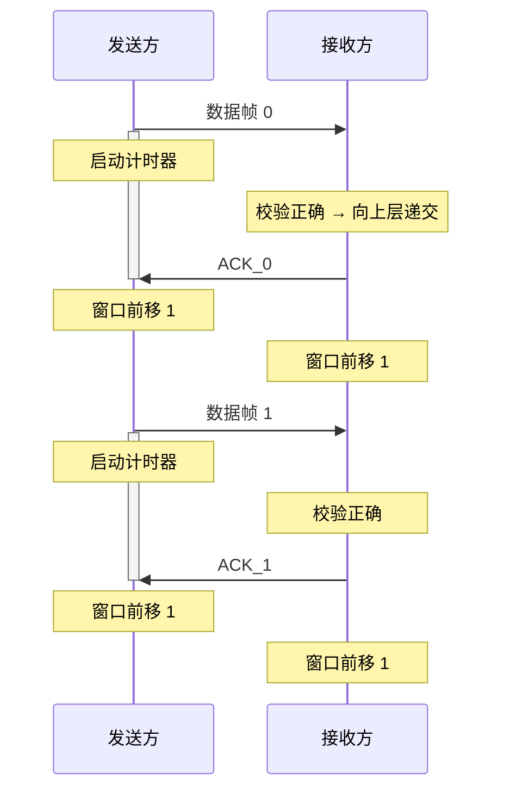

## 3.1 数据链路层的功能

> 数据链路层在物理层之上，为网络层提供服务。主要功能：封装成帧、透明传输、流量控制、差错控制。

---

### 封装成帧

- 将网络层交下来的数据包添加**首部**和**尾部**，构成一个**帧**（Frame）
- 首部和尾部包含帧定界信息，用于标识帧的开始与结束
- 帧是数据链路层的传输单元

### 透明传输

- 数据链路层对上层（网络层）**透明**：无论上层数据包含什么样的比特组合，都必须能正常传输
- 问题：如果数据中出现了与帧定界符相同的比特组合，接收方会误判为帧边界
- 解决思路：对数据中出现的"敏感"比特组合做转义处理，保证定界符的唯一性

### 流量控制

- 限制发送方的发送速率，防止接收方缓冲区溢出
- 与传输层的流量控制不同：数据链路层控制的是**相邻节点间**的流量——范围更小
- 数据链路层通过**滑动窗口机制**实现流量控制

### 差错控制

**两种差错类型**

| 类型 | 英文 | 含义 |
|------|------|------|
| 位错 | Bit Error | 比特在传输中发生翻转（$0 \rightarrow 1$ 或 $1 \rightarrow 0$） |
| 帧错 | Frame Error | 帧丢失、帧重复、帧失序 |

**不同链路质量下的策略**

| 链路类型 | 策略 | 原因 |
|----------|------|------|
| 无线链路（通信质量较差） | 确认 + 重传（ARQ） | 误码率高，需保证可靠性 |
| 有线链路（高质量） | 仅 CRC 校验 | 误码率极低，重传开销不值得 |

### ⚠️ 易错点

> **高质量有线链路中，数据链路层使用"无确认无连接服务"。**

**为什么数据链路层选择了"不可靠"的服务？**

1. 有线链路误码率极低（光纤等介质通常 $< 10^{-12}$），出错概率极小
2. 若每一帧都做确认 + 重传，开销远远大于收益
3. 可靠传输的责任**上移到传输层**（如 TCP 的确认与重传机制）
4. 数据链路层的策略：CRC 检错 → 检测到错误直接丢弃 → 由高层负责补传

> 💡 一句话记忆：**有线靠 CRC 检错丢弃，无线靠 ARQ 确认重传；可靠保障不在链路层，在传输层。**

---

## 3.2 组帧
### 知识点
1. 字符计数法
2. 字节填充法
3. 零比特填充法.

## 3.4 流量控制与可靠传输机制

![[大纲.png]]

### 概述

- **流量控制**：控制发送方的发送速率，使接收方来得及接收与处理
- **可靠传输**：保证数据无差错、不丢失、不重复、按序到达
- **实现手段**：确认机制 + 超时重传 + 滑动窗口

---

### 滑动窗口机制

#### 基本概念

- **发送窗口 $W_T$**：发送方当前允许发送的帧序号集合
- **接收窗口 $W_R$**：接收方当前允许接收的帧序号集合

#### 窗口规则

- 窗口外的帧**不允许**发送
- 收到接收窗口以外的帧，直接丢弃
- 接收方通过控制 ACK 的发送，间接控制发送方窗口的滑动 → **流量控制**

#### 帧编号约束

- 使用 $n$ 位编号时，共 $2^n$ 个可用序号
- 需满足 $W_T + W_R \leq 2^n$，以防止新旧帧因序号重叠而混淆

---

### 停止等待协议（Stop-and-Wait）

> **核心思想**：发送方每发一帧就停下来，等待接收方确认后再发下一帧。

#### 关键参数

| 参数 | 值 |
|------|:---:|
| 发送窗口 $W_T$ | $1$ |
| 接收窗口 $W_R$ | $1$ |
| 帧编号位数 | $1$ bit |
| 编号循环 | $0 \rightarrow 1 \rightarrow 0 \rightarrow 1 \rightarrow \cdots$ |
| 窗口约束 | $W_T + W_R = 2 \leq 2^1$ ✓ |

#### 正常流程

#### 异常情况处理

##### 1. 数据帧出错

- 接收方校验发现差错 → **丢弃该帧**，不发送 ACK
- 发送方**超时** → 重传该数据帧
- 重传正确 → 接收方返回 ACK，双方窗口前移

##### 2. ACK 丢失

- 接收方已正确接收并返回 ACK，但 ACK 在半路丢失
- 发送方**超时** → 重传数据帧（发送方不知是 ACK 丢了）
- 接收方收到**重复帧** → 识别帧编号 → 丢弃该帧 → **重发 ACK**

##### 3. 收到重复帧

- 接收方通过帧编号识别（连续收到两个同编号帧）
- 丢弃重复帧，再次发送对应 ACK

#### 特点

| 优点 | 缺点 |
|------|------|
| 实现简单 | 信道利用率低（大量时间花在等待确认） |
| 不存在"数据帧失序"问题 | 适用于信道质量好、距离近的场景 |

> **流量控制实现**：接收方通过控制 ACK 的发送来间接控制发送方窗口的滑动，发送方只有在收到 ACK 后才能前移窗口。数据帧绝不会失序（因为一次只发一帧，$W_T = 1$）。

---
### 后退N帧

wt>1 wr=1
特点：接收方可以“累积确认”，连续收到多个数据帧后，可以仅返回最后一个帧的ACK
	ACK_i表示收到了i之前的所有
序号位数：与窗口大小有关 log_2 窗口大小

**数据丢失**
若0号数据帧丢失
返回最后收到正确帧的ACK（如ACK_3），发送方移动到3+1=4
 