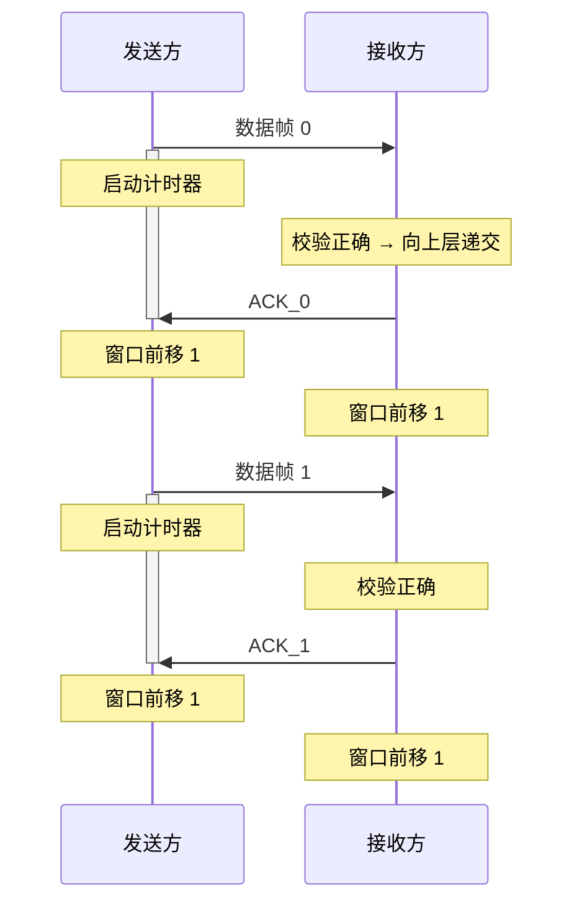

## 3.4 流量控制与可靠传输机制

![[大纲.png]]

### 概述

- **流量控制**：控制发送方的发送速率，使接收方来得及接收与处理
- **可靠传输**：保证数据无差错、不丢失、不重复、按序到达
- **实现手段**：确认机制 + 超时重传 + 滑动窗口

---

### 滑动窗口机制

#### 基本概念

- **发送窗口 $W_T$**：发送方当前允许发送的帧序号集合
- **接收窗口 $W_R$**：接收方当前允许接收的帧序号集合

#### 窗口规则

- 窗口外的帧**不允许**发送
- 收到接收窗口以外的帧，直接丢弃
- 接收方通过控制 ACK 的发送，间接控制发送方窗口的滑动 → **流量控制**

#### 帧编号约束

- 使用 $n$ 位编号时，共 $2^n$ 个可用序号
- 需满足 $W_T + W_R \leq 2^n$，以防止新旧帧因序号重叠而混淆

---

### 停止等待协议（Stop-and-Wait）

> **核心思想**：发送方每发一帧就停下来，等待接收方确认后再发下一帧。

#### 关键参数

| 参数 | 值 |
|------|:---:|
| 发送窗口 $W_T$ | $1$ |
| 接收窗口 $W_R$ | $1$ |
| 帧编号位数 | $1$ bit |
| 编号循环 | $0 \rightarrow 1 \rightarrow 0 \rightarrow 1 \rightarrow \cdots$ |
| 窗口约束 | $W_T + W_R = 2 \leq 2^1$ ✓ |

#### 正常流程

#### 异常情况处理

##### 1. 数据帧出错

- 接收方校验发现差错 → **丢弃该帧**，不发送 ACK
- 发送方**超时** → 重传该数据帧
- 重传正确 → 接收方返回 ACK，双方窗口前移

##### 2. ACK 丢失

- 接收方已正确接收并返回 ACK，但 ACK 在半路丢失
- 发送方**超时** → 重传数据帧（发送方不知是 ACK 丢了）
- 接收方收到**重复帧** → 识别帧编号 → 丢弃该帧 → **重发 ACK**

##### 3. 收到重复帧

- 接收方通过帧编号识别（连续收到两个同编号帧）
- 丢弃重复帧，再次发送对应 ACK

#### 特点

| 优点 | 缺点 |
|------|------|
| 实现简单 | 信道利用率低（大量时间花在等待确认） |
| 不存在"数据帧失序"问题 | 适用于信道质量好、距离近的场景 |

> **流量控制实现**：接收方通过控制 ACK 的发送来间接控制发送方窗口的滑动，发送方只有在收到 ACK 后才能前移窗口。数据帧绝不会失序（因为一次只发一帧，$W_T = 1$）。
