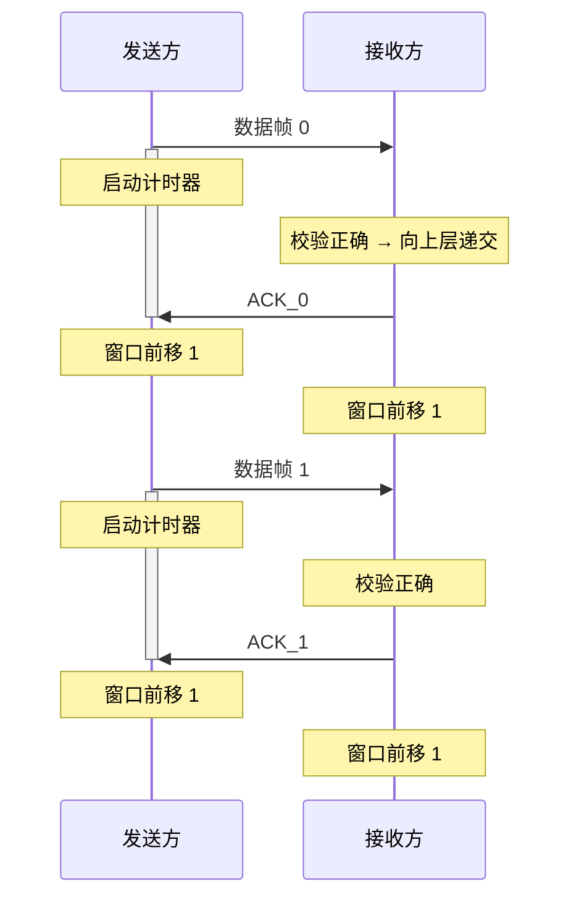
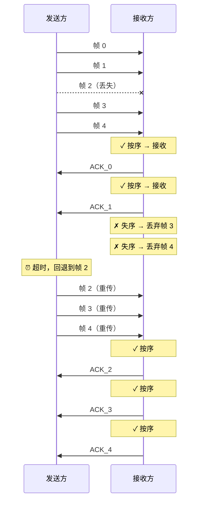
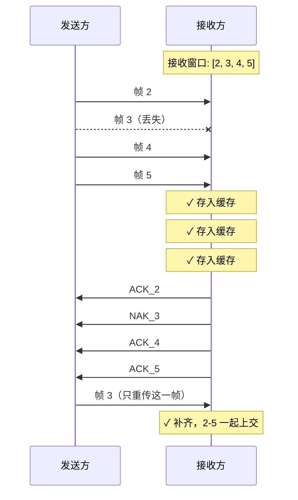

## 3.4 流量控制与可靠传输机制

![[大纲.png]]

### 概述

- **流量控制**：控制发送方的发送速率，使接收方来得及接收与处理
- **可靠传输**：保证数据无差错、不丢失、不重复、按序到达
- **实现手段**：确认机制 + 超时重传 + 滑动窗口

---

### 滑动窗口机制

#### 基本概念

- **发送窗口 $W_T$**：发送方当前允许发送的帧序号集合
- **接收窗口 $W_R$**：接收方当前允许接收的帧序号集合

#### 窗口规则

- 窗口外的帧**不允许**发送
- 收到接收窗口以外的帧，直接丢弃
- 接收方通过控制 ACK 的发送，间接控制发送方窗口的滑动 → **流量控制**

#### 帧编号约束

- 使用 $n$ 位编号时，共 $2^n$ 个可用序号
- 需满足 $W_T + W_R \leq 2^n$，以防止新旧帧因序号重叠而混淆

---

### 停止等待协议（Stop-and-Wait）

> **核心思想**：发送方每发一帧就停下来，等待接收方确认后再发下一帧。

#### 关键参数

| 参数 | 值 |
|------|:---:|
| 发送窗口 $W_T$ | $1$ |
| 接收窗口 $W_R$ | $1$ |
| 帧编号位数 | $1$ bit |
| 编号循环 | $0 \rightarrow 1 \rightarrow 0 \rightarrow 1 \rightarrow \cdots$ |
| 窗口约束 | $W_T + W_R = 2 \leq 2^1$ ✓ |

#### 正常流程

#### 异常情况处理

##### 1. 数据帧出错

- 接收方校验发现差错 → **丢弃该帧**，不发送 ACK
- 发送方**超时** → 重传该数据帧
- 重传正确 → 接收方返回 ACK，双方窗口前移

##### 2. ACK 丢失

- 接收方已正确接收并返回 ACK，但 ACK 在半路丢失
- 发送方**超时** → 重传数据帧（发送方不知是 ACK 丢了）
- 接收方收到**重复帧** → 识别帧编号 → 丢弃该帧 → **重发 ACK**

##### 3. 收到重复帧

- 接收方通过帧编号识别（连续收到两个同编号帧）
- 丢弃重复帧，再次发送对应 ACK

#### 特点

| 优点 | 缺点 |
|------|------|
| 实现简单 | 信道利用率低（大量时间花在等待确认） |
| 不存在"数据帧失序"问题 | 适用于信道质量好、距离近的场景 |

> **流量控制实现**：接收方通过控制 ACK 的发送来间接控制发送方窗口的滑动，发送方只有在收到 ACK 后才能前移窗口。数据帧绝不会失序（因为一次只发一帧，$W_T = 1$）。

---

### 后退 N 帧协议 — GBN（Go-Back-N）

> **核心思想**：发送方可以连续发送多帧，但接收方只按序接收。出错或超时时，回退到出错帧重新发送其后所有帧。

#### 关键参数

| 参数 | 值 |
|------|:---:|
| 发送窗口 $W_T$ | $> 1$ |
| 接收窗口 $W_R$ | $1$（只按序接收） |
| 帧编号位数 | $n$ bit |
| 窗口约束 | $W_T \leq 2^n - 1$ |
| 典型配置（$n=3$） | $W_T = 7$ |

#### 工作要点

- **流水线发送**：发送方可连续发送窗口内所有帧，不必每发一帧就等待
- **只按序接收**：接收方窗口 $W_R = 1$，只接收序号匹配的那一帧；失序帧**直接丢弃**
- **累积确认**：ACK_n 表示 $n$ 号及之前的所有帧已正确收到
- **超时重传**：超时后，发送方回退到最早的未确认帧，重传该帧及其后所有已发帧

#### 特点

| 优点 | 缺点 |
|------|------|
| 信道利用率比停止等待高 | 一个帧出错，可能大量重传（即使后面的帧正确到达也要重传） |
| 实现比 SR 简单 | 信道误码率高时性能急剧下降 |

---

### 选择重传协议 — SR（Selective Repeat）

> **核心思想**：接收方可以接收窗口内任意帧（允许失序接收），发送方只重传真正丢失或出错的帧。

#### 关键参数

| 参数 | 值 |
|------|:---:|
| 发送窗口 $W_T$ | $> 1$ |
| 接收窗口 $W_R$ | $> 1$ |
| 帧编号位数 | $n$ bit |
| 窗口约束 | $W_T + W_R \leq 2^n$ |
| 典型配置（$n=3$） | $W_T = W_R = 4$ |

#### 工作要点

- **可失序接收**：接收窗口内有多个位置，可缓存不连续的帧
- **逐帧确认**：每正确收到一帧就返回对应的 ACK（非累积确认）
- **按序上交**：接收方缓存失序帧，等前面的帧到齐后一并上交高层
- **选择性重传**：超时后只重传丢失的那一帧，不影响其他已正确接收的帧

#### 特点

| 优点 | 缺点 |
|------|------|
| 重传效率最高（只重传出错帧） | 实现复杂（需维护接收缓冲区、逐一确认） |
| 信道利用率高 | 需要更大的接收窗口和缓存空间 |

---

### 三种协议对比

| | 停止等待 | GBN（后退 N 帧） | SR（选择重传） |
|---|:---:|:---:|:---:|
| 发送窗口 $W_T$ | $1$ | $> 1$ | $> 1$ |
| 接收窗口 $W_R$ | $1$ | $1$ | $> 1$ |
| 确认方式 | 逐帧 ACK | 累积确认 | 逐帧 ACK |
| 可失序接收 | ❌ | ❌ | ✅ |
| 重传范围 | 仅超时的那帧 | 窗口内所有未确认帧 | 仅丢失/出错帧 |
| 编号约束 | $W_T + W_R \leq 2^n$ | $W_T \leq 2^n - 1$ | $W_T + W_R \leq 2^n$ |
| 信道利用率 | 低 | 中 | 高 |
| 实现复杂度 | 简单 | 中等 | 复杂 |
| 典型用途 | 简单链路 | 误码率低的链路 | 高速、高误码率链路 |
