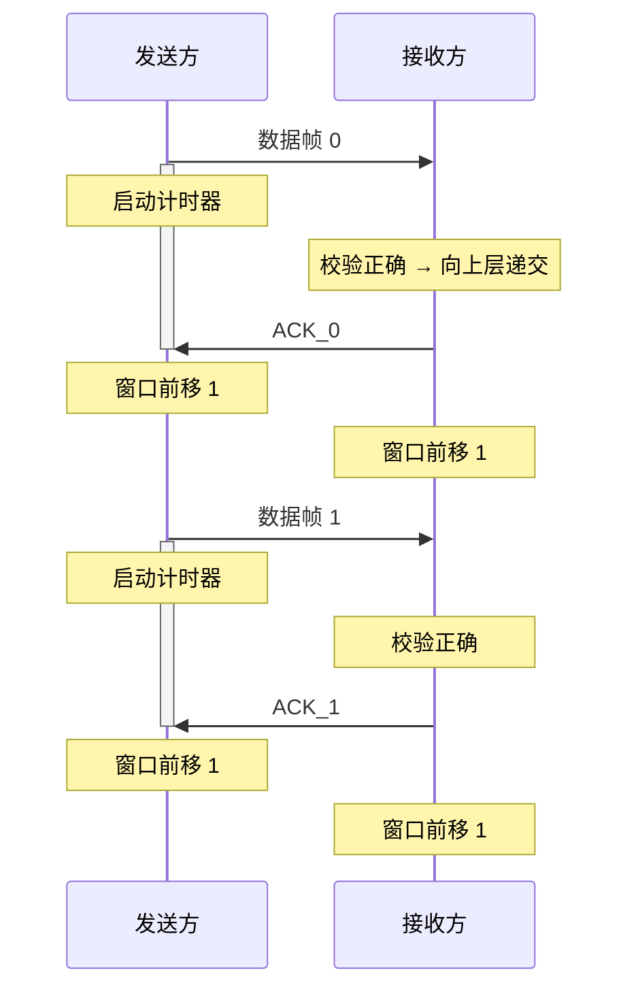
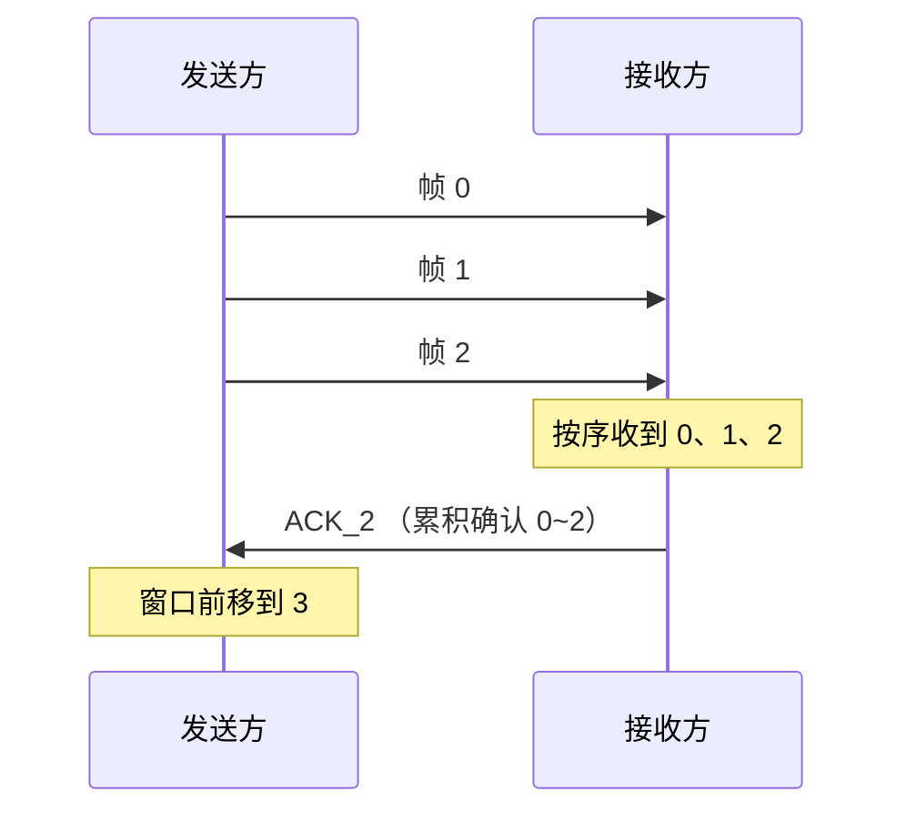

## 3.1 数据链路层的功能

> 数据链路层在物理层之上，为网络层提供服务。主要功能：封装成帧、透明传输、流量控制、差错控制。

---

### 封装成帧

- 将网络层交下来的数据包添加**首部**和**尾部**，构成一个**帧**（Frame）
- 首部和尾部包含帧定界信息，用于标识帧的开始与结束
- 帧是数据链路层的传输单元

### 透明传输

- 数据链路层对上层（网络层）**透明**：无论上层数据包含什么样的比特组合，都必须能正常传输
- 问题：如果数据中出现了与帧定界符相同的比特组合，接收方会误判为帧边界
- 解决思路：对数据中出现的"敏感"比特组合做转义处理，保证定界符的唯一性

### 流量控制

- 限制发送方的发送速率，防止接收方缓冲区溢出
- 与传输层的流量控制不同：数据链路层控制的是**相邻节点间**的流量——范围更小
- 数据链路层通过**滑动窗口机制**实现流量控制

### 差错控制

**两种差错类型**

| 类型 | 英文 | 含义 |
|------|------|------|
| 位错 | Bit Error | 比特在传输中发生翻转（$0 \rightarrow 1$ 或 $1 \rightarrow 0$） |
| 帧错 | Frame Error | 帧丢失、帧重复、帧失序 |

**不同链路质量下的策略**

| 链路类型 | 策略 | 原因 |
|----------|------|------|
| 无线链路（通信质量较差） | 确认 + 重传（ARQ） | 误码率高，需保证可靠性 |
| 有线链路（高质量） | 仅 CRC 校验 | 误码率极低，重传开销不值得 |

### ⚠️ 易错点

> **高质量有线链路中，数据链路层使用"无确认无连接服务"。**

**为什么数据链路层选择了"不可靠"的服务？**

1. 有线链路误码率极低（光纤等介质通常 $< 10^{-12}$），出错概率极小
2. 若每一帧都做确认 + 重传，开销远远大于收益
3. 可靠传输的责任**上移到传输层**（如 TCP 的确认与重传机制）
4. 数据链路层的策略：CRC 检错 → 检测到错误直接丢弃 → 由高层负责补传

> 💡 一句话记忆：**有线靠 CRC 检错丢弃，无线靠 ARQ 确认重传；可靠保障不在链路层，在传输层。**

---

## 3.2 组帧

> 封装成帧的核心挑战：既要**帧定界**（知道帧从哪开始、到哪结束），又要**透明传输**（数据中碰巧出现定界符时不能误判）。

### 🧠 回忆录

| 方法 | 定界方式 | 透明传输策略 | 致命弱点 |
|------|---------|-------------|---------|
| 字符计数法 | 首部记录帧长度 | — | 计数字段出错 → 后续全乱，无法恢复 |
| 字节填充法 | 特殊标志字节（FLAG） | 数据中的 FLAG 前加转义符 ESC | 依赖 8 位编码，不适用任意比特流 |
| 零比特填充法 | 比特模式 `01111110` | 数据中每 5 个连续 1 后自动插 0 | —（实际最常用） |
| 违规编码法 | 物理层违规信号（如无效电平） | 违规信号不会出现在合法数据中 | 依赖特定物理层编码方案 |

---

### 字符计数法

- 在帧**首部**用一个计数字段，标明该帧的总字节数（含首部）
- 接收方读出计数值 → 按计数接收对应字节 → 下一字节即为下一帧的计数字段
- **致命缺陷**：计数字段传输中一旦出错，接收方对帧边界的判断全盘错位，且无法自动恢复
- 现已基本淘汰

### 字节填充法

- 使用**特殊字节**（常称 FLAG 或 SOH/EOT）标记帧的起始和结束
- **透明传输**：当数据中出现了与 FLAG 相同的字节 →
  1. 发送方在 FLAG 前插入一个**转义字符 ESC**
  2. 接收方识别到 ESC 后，知道下一个 FLAG 是数据而非定界符，去掉 ESC 保留原字节
- **局限**：要求数据以 8 位字符为单位，不适合处理任意比特流

### 零比特填充法

- 使用特殊比特模式 **`01111110`**（首尾各一个 0、中间 6 个 1）作为帧定界标志
- **透明传输**（核心机制）：
  1. 发送方扫描数据比特流，每遇到 **5 个连续的 1** 就自动在其后插入一个 **0**
  2. 接收方做逆操作：每收到 5 个连续的 1，删除其后的那个 0
  3. 保证了数据中永远不会出现 `01111110`，定界符始终唯一
- **优点**：不依赖字符编码，适用于任意比特流；硬件实现简单
- **实际应用**：HDLC、PPP 等协议广泛使用

### 违规编码法

- 利用**物理层编码中的违规信号**来标记帧边界——不需要额外插入数据
- **原理**：物理层编码方案中，某些信号组合是"非法"的（不会出现在合法编码中），拿来当定界标志刚好
- **透明传输天然满足**：违规信号不会与合法数据混淆，无需填充/转义，无带宽开销
- **典型例子**：曼彻斯特编码中"没有中间跳变"的电平就是违规信号，用作帧边界
- **局限**：依赖特定的物理层编码方案，不是所有链路都适用

## 3.3 差错控制

### 🧠 回忆录

| 方法 | 类型 | 能力 | 一句话核心 |
|------|:---:|------|-----------|
| 奇偶检验码 | 检错 | 检奇数位错 | 凑 1 的个数为奇/偶 |
| 循环冗余码 (CRC) | 检错 | 检绝大多数错 | 多项式除法，余数即校验 |
| 海明码 | 纠错 | 纠 1 位错 | 多组奇偶校验交叉定位 |

> **码距 $d$ 的两个核心结论**：
> - 要**检测** $d$ 位错 → 最小码距 $\geq d+1$
> - 要**纠正** $d$ 位错 → 最小码距 $\geq 2d+1$

---

### 码距（Hamming Distance）

- **定义**：两个编码在对应位上**不同比特的个数**
- 例：`1010` 与 `1100` 在第 2、3 位不同 → 码距 = 2

**两个重要结论**（考研必记）：

| 目标 | 最小码距要求 | 直观理解 |
|------|:----------:|---------|
| 检测 $d$ 个错误 | $d_{min} \geq d + 1$ | 错了之后的码字不能是另一个合法码字 |
| 纠正 $d$ 个错误 | $d_{min} \geq 2d + 1$ | 错了之后离原码字比离其他合法码字更近，能"拉回来" |

---

### 检错编码

#### 奇偶检验码

- 在数据后追加 1 bit **校验位**，使得整个码字中 1 的个数为奇数（奇检验）或偶数（偶检验）
- 例（偶检验）：数据 `1010010` 有 3 个 1 → 校验位填 `1`，凑成 4 个 1（偶数）
- ✅ 可检测**任意奇数**个位错
- ❌ 无法检测偶数个位错（翻转 2 个 0 或 2 个 1，奇偶性不变）
- ❌ 只能检错，不能纠错

#### 循环冗余码 — CRC

> **核心思想**：把数据看作一个二进制多项式，除以一个商定的生成多项式，余数就是 CRC 校验码。接收方用同样的生成多项式去除——整除说明没错。

**计算三步走：**

1. 选定生成多项式 $G(x)$（$r$ 阶 → 对应 $r+1$ 位二进制）
2. 待发送数据后**追加 $r$ 个 0**（相当于 $\times 2^r$）
3. 用追加 0 后的数据**模 2 除法**除以 $G(x)$，余数即 CRC 码

**发送帧** = 原始数据 + CRC 余数

---

##### 📐 例题

> 设发送数据 $M = 101001$，生成多项式 $G(x) = x^3 + x^2 + 1$，求 CRC 校验码与最终发送帧。

**解：**

**Step 1 — 确定参数**

$G(x) = x^3 + x^2 + 1$ → 二进制 `1101`，阶数 $r = 3$

**Step 2 — 追加 r 个 0**

$M$ 后补 3 个 0 → `101001 000`

**Step 3 — 模 2 除法（逐位 XOR，不进位不借位）**

```
          111001     ← 商（不需要，仅供观察）
    ━━━━━━━━━━━━
1101 | 101001000
       1101        ← 第1步：对齐最左1，XOR
       ──────
       01110       ← 去前导0 → 1110
        1101       ← 第2步：对齐，XOR
        ──────
        00110      → 110
          0000     ← 不足4位，补0，不XOR
          ──────
          01100    → 1100
           1101    ← 第3步：对齐，XOR
           ──────
           00010   → 10
             0000  ← 不足4位，补0
             ──────
             00100 → 100
              0000 ← 不足4位，补0
              ──────
              01000 → 1000
               1101 ← 第4步：对齐，XOR
               ──────
               01010 → 1010
                1101 ← 第5步：对齐，XOR
                ──────
                01110 → 1110
                 1101 ← 第6步：对齐，XOR
                 ──────
                 0011  ← 余数 = 011（保留 r=3 位）
```

> **技巧速算**：不用把每一步都写出来，只需记住：每轮拿当前被除数的最高位去"碰"生成多项式——最高位对齐后全 XOR，然后去前导 0，重复。

**Step 4 — 得到结果**

余数 = `011` → CRC 校验码 = `011`

最终发送帧 = 原始数据 + CRC = **`101001 011`**

---

**接收方验算：**

收到 `101001011`，除以同一个 $G(x) = 1101$：

```
101001011 ÷ 1101
```

算出来余数 = `000` → **整除，传输无误** ✓

---

### 纠错编码 — 海明码

> **一句话理解**：海明码就是**多组奇偶校验的叠加**——每个数据位受到多组校验的"交叉监护"。一旦某位出错，通过"哪些组报了错"就能反推出出错位置并纠正。

#### 感性认识：三线交叉定位

想象你用 **3 条线** 把 7 个位置圈起来：

- **组 1** 圈住位置 {1, 3, 5, 7}
- **组 2** 圈住位置 {2, 3, 6, 7}
- **组 4** 圈住位置 {4, 5, 6, 7}

每个圈给你一条规则：**圈内 1 的个数必须为偶数**。

现在，如果位置 6 出了错（0 翻成了 1）：
- 组 1（1,3,5,7）：没变化 ✓
- 组 2（2,3,6,7）：多了一个 1 ✗
- 组 4（4,5,6,7）：多了一个 1 ✗

报了错的组是组 2 和组 4 → $2 + 4 = 6$，出错位置就是 **6**！翻回去就纠正了。

> 💡 **本质**：错误位置 = **所有报错组的编号之和**。

#### 正式步骤

**① 确定校验位数量**

$m$ 位数据 → 设 $r$ 位校验位，需满足 $2^r \geq m + r + 1$

例：4 位数据 → $m=4$，试 $r=2$：$4 < 7$ ✗；试 $r=3$：$8 \geq 8$ ✓ → 共 $n = 7$ 位码字

**② 校验位放 2 的幂次位置**

7 位码字：位置 1=P1, 2=P2, 3=D3, 4=P4, 5=D5, 6=D6, 7=D7

**③ 确定每个校验位管哪些位置**

位置号写成二进制，校验位 P_i 管"二进制第 i 位为 1"的位置：

| 校验位 | 负责的位置 | 二进制规律 |
|:------:|-----------|-----------|
| P1 | 1, 3, 5, 7 | 二进制末位 = 1（奇数位） |
| P2 | 2, 3, 6, 7 | 二进制中间位 = 1 |
| P4 | 4, 5, 6, 7 | 二进制最高位 = 1 |

**④ 每个组做偶检验，算出 P_i**

---

##### 📐 例题

> 4 位数据 $D_3 D_5 D_6 D_7 = 1010$，求海明码。

**编码：**

| 位置 | 1 | 2 | 3 | 4 | 5 | 6 | 7 |
|:---:|:-:|:-:|:-:|:-:|:-:|:-:|:-:|
| 身份 | P1 | P2 | D3 | P4 | D5 | D6 | D7 |
| 值 | **?** | **?** | 1 | **?** | 0 | 1 | 0 |

- **P1**（管 1,3,5,7）：$P1 \oplus 1 \oplus 0 \oplus 0 = 0$ → $P1 = 1$
- **P2**（管 2,3,6,7）：$P2 \oplus 1 \oplus 1 \oplus 0 = 0$ → $P2 = 0$
- **P4**（管 4,5,6,7）：$P4 \oplus 0 \oplus 1 \oplus 0 = 0$ → $P4 = 1$

**发送码字：`1 0 1 1 0 1 0`**

---

**检错与纠错（假设传输中位置 6 翻转，收到 `1 0 1 1 0 0 0`）：**

接收方重新算三个组：

- $S_1 = P1 \oplus D3 \oplus D5 \oplus D7 = 1 \oplus 1 \oplus 0 \oplus 0 = 0$（组1正常）
- $S_2 = P2 \oplus D3 \oplus D6 \oplus D7 = 0 \oplus 1 \oplus \mathbf{0} \oplus 0 = 1$（组2异常！）
- $S_4 = P4 \oplus D5 \oplus D6 \oplus D7 = 1 \oplus 0 \oplus \mathbf{0} \oplus 0 = 1$（组4异常！）

报错组：$S_4 S_2 S_1 = 110_2 = \mathbf{6}$ → 位置 6 出错！

翻转位置 6：`1 0 1 1 0 0 0` → **`1 0 1 1 0 1 0`** ✓ 纠错完成

## 3.4 流量控制与可靠传输机制

![[大纲.png]]

### 概述

- **流量控制**：控制发送方的发送速率，使接收方来得及接收与处理
- **可靠传输**：保证数据无差错、不丢失、不重复、按序到达
- **实现手段**：确认机制 + 超时重传 + 滑动窗口

---

### 滑动窗口机制

#### 基本概念

- **发送窗口 $W_T$**：发送方当前允许发送的帧序号集合
- **接收窗口 $W_R$**：接收方当前允许接收的帧序号集合

#### 窗口规则

- 窗口外的帧**不允许**发送
- 收到接收窗口以外的帧，直接丢弃
- 接收方通过控制 ACK 的发送，间接控制发送方窗口的滑动 → **流量控制**

#### 帧编号约束

- 使用 $n$ 位编号时，共 $2^n$ 个可用序号
- 需满足 $W_T + W_R \leq 2^n$，以防止新旧帧因序号重叠而混淆

---

### 停止等待协议（Stop-and-Wait）

> **核心思想**：发送方每发一帧就停下来，等待接收方确认后再发下一帧。

#### 关键参数

| 参数 | 值 |
|------|:---:|
| 发送窗口 $W_T$ | $1$ |
| 接收窗口 $W_R$ | $1$ |
| 帧编号位数 | $1$ bit |
| 编号循环 | $0 \rightarrow 1 \rightarrow 0 \rightarrow 1 \rightarrow \cdots$ |
| 窗口约束 | $W_T + W_R = 2 \leq 2^1$ ✓ |

#### 正常流程



#### 异常情况处理

##### 1. 数据帧出错

- 接收方校验发现差错 → **丢弃该帧**，不发送 ACK
- 发送方**超时** → 重传该数据帧
- 重传正确 → 接收方返回 ACK，双方窗口前移

##### 2. ACK 丢失

- 接收方已正确接收并返回 ACK，但 ACK 在半路丢失
- 发送方**超时** → 重传数据帧（发送方不知是 ACK 丢了）
- 接收方收到**重复帧** → 识别帧编号 → 丢弃该帧 → **重发 ACK**

##### 3. 收到重复帧

- 接收方通过帧编号识别（连续收到两个同编号帧）
- 丢弃重复帧，再次发送对应 ACK

#### 特点

| 优点 | 缺点 |
|------|------|
| 实现简单 | 信道利用率低（大量时间花在等待确认） |
| 不存在"数据帧失序"问题 | 适用于信道质量好、距离近的场景 |

> **流量控制实现**：接收方通过控制 ACK 的发送来间接控制发送方窗口的滑动，发送方只有在收到 ACK 后才能前移窗口。数据帧绝不会失序（因为一次只发一帧，$W_T = 1$）。

---

### 后退 N 帧协议 — GBN（Go-Back-N）

> **核心思想**：发送方可连续发送多帧（流水线），接收方只按序接收。某帧出错或超时后，发送方**回退**到该帧，重传它及其后已发的所有帧。

#### 关键参数

| 参数 | 值 |
|------|:---:|
| 发送窗口 $W_T$ | $> 1$ |
| 接收窗口 $W_R$ | $1$（只按序接收一帧） |
| 帧编号位数 | $n$ bit（与窗口大小有关，$n = \lceil \log_2(\text{窗口大小}) \rceil$ 起步） |
| 窗口约束 | $W_T + W_R \leq 2^n$，即 $W_T \leq 2^n - 1$ |

#### 工作要点

- **流水线发送**：发送方不必每发一帧就停等，可连续发出窗口内所有帧
- **只按序接收**：接收方 $W_R = 1$，只接收序号正确的下一帧；**失序帧一律丢弃**
- **累积确认**：接收方连续收到多帧后，可只返回最后一帧的 ACK
  - $\text{ACK}_i$ 表示「$i$ 号及之前的所有帧」都已正确收到
  - 好处：即使个别 ACK 丢失，后续 ACK 也能补充确认

#### 正常流程



#### 异常情况处理

##### 1. 数据帧丢失

- 若 0 号数据帧丢失，后续帧（1、2、3…）因失序被接收方**全部丢弃**
- 接收方始终返回「最后一个按序正确收到帧」的 ACK
- 发送方超时后**回退到 0 号**，重传 0 号及其后所有已发帧

> 注：若是中途某帧丢失（如已正确收到 1、2、3，4 号丢失），接收方持续返回 $\text{ACK}_3$；发送方超时后回退到 4 号，从 $3+1=4$ 开始重传。

##### 2. ACK 丢失

- 若 0 号 ACK 丢失，但后续 ACK 能累积确认 → **不必重传**
- 若该 ACK 之后再无新的 ACK 补充 → 发送方超时 → **回退到 0 号**，重传 0 号及后面所有帧

#### ⚠️ 易错点：为什么必须满足 $W_T + W_R \leq 2^n$？

> **若不满足（即 $W_T$ 取到 $2^n$），接收方将无法区分「新帧」和「旧帧的重传」。**

**举例说明**（设 $n = 2$，序号 $0\sim3$ 循环，错误地取 $W_T = 4$）：

1. 发送方连发 0、1、2、3 四帧，接收方**全部正确收到**，逐一返回 ACK
2. 但**所有 ACK 都在半路丢失**
3. 接收方此时期待下一轮的 0 号（新数据）
4. 发送方因收不到 ACK，超时**重传旧的 0 号**
5. 接收方看到 0 号，**误以为是新一轮的数据帧** → 错误接收 ❌

**根因**：序号空间 $2^n$ 被发送窗口占满，新旧帧序号完全重叠，接收方失去辨别能力。

✅ 因此 GBN 中 $W_T \leq 2^n - 1$——必须留出至少一个序号作"缓冲"，让新旧帧的序号永不重叠。

#### 特点

| 优点 | 缺点 |
|------|------|
| 信道利用率比停止等待高（流水线发送） | 一帧出错可能引发大量重传（后面正确到达的帧也要重传） |
| 累积确认，对 ACK 丢失有一定容错 | 信道误码率高时性能急剧下降 |
